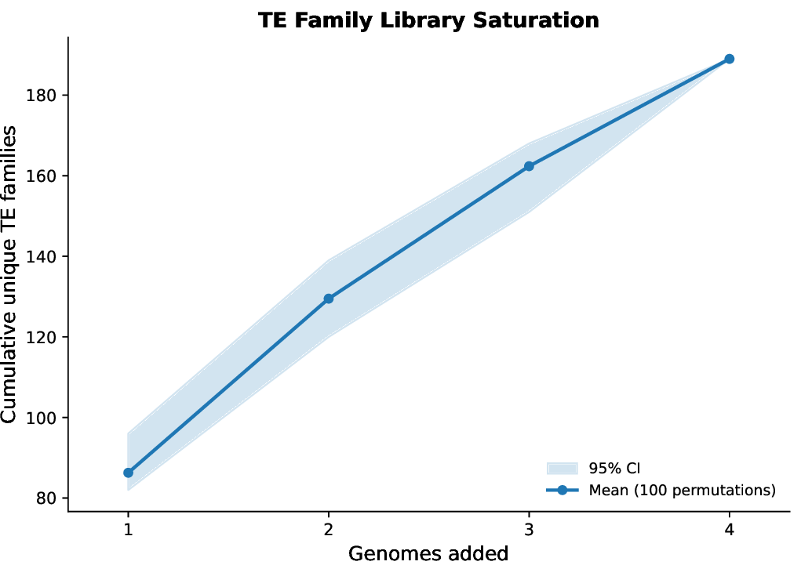
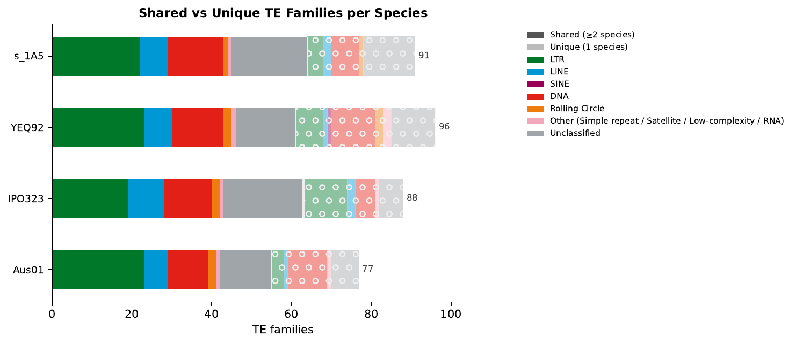
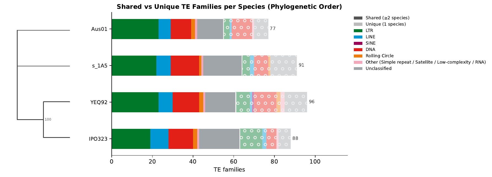
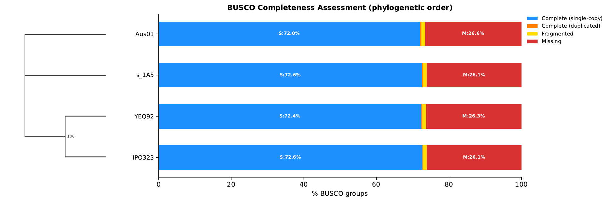
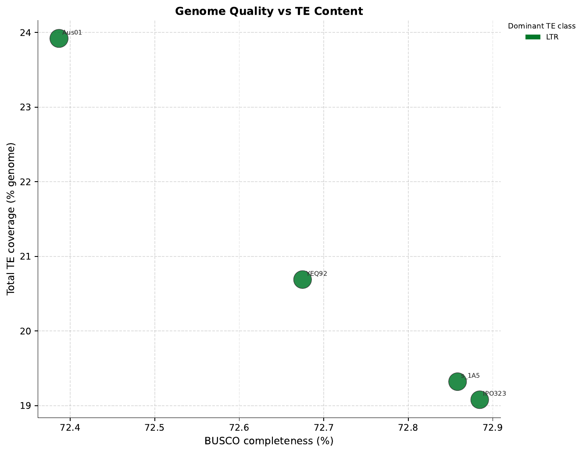

<div align="center">


# EarlGrey Pangenome Pipeline (ParTEA)

### 🎉 *Multiple genomes? Time for a parTEA!* 🎉

**Because analyzing transposable elements across genomes should be a parTEA, not a chore.**

[](https://doi.org/10.5281/zenodo.18936437)
[](https://github.com/TobyBaril/EarlGreyParTEA)
[](https://anaconda.org/bioconda/earlgrey-partea)
[](https://github.com/TobyBaril/EarlGrey)

</div>

---

## What is ParTEA?

ParTEA (**Pan**genome **T**ransposable **E**lement **A**nalysis) is a Snakemake-based pipeline that brings the party to multi-genome TE annotation! It extends [EarlGrey](https://github.com/TobyBaril/EarlGrey) to process multiple genomes in parallel, build pangenome TE libraries, and perform comparative transposable element analysis across species.

**Why ParTEA?**
- 🎊 **Parallel Processing**: Analyze multiple genomes simultaneously
- 🧬 **Pangenome Libraries**: Build consensus TE libraries across species
- 🔄 **Optional Clustering**: Merge TE libraries using cd-hit for consistent and traceable naming in annotations across all genomes
- 📊 **Rich Outputs**: Get annotations, divergence metrics, and visualizations
- ⚡ **Dynamic Threading**: Automatically optimizes resource allocation
- 🔍 **Version-Agnostic**: Works seamlessly with any EarlGrey version

## 📖 Citation

**If you use ParTEA in your research, please cite:**

Baril, T., Galbraith, J. and Hayward, A., 2024. Earl Grey: a fully automated user-friendly transposable element annotation and analysis pipeline. *Molecular Biology and Evolution*, 41(4), p.msae068.

*ParTEA manuscript in preparation.*

---

## ✨ ParTEA Features

ParTEA extends EarlGrey with features designed for multi-genome comparative TE analysis:

- 🎊 **Parallel Processing** — All per-genome steps (RepeatModeler, TEstrainer) run simultaneously across input genomes, limited only by the cores you provide.
- 🧬 **Pangenome TE Libraries** — Per-genome libraries are combined and optionally clustered with cd-hit-est to produce a single non-redundant pangenome TE library with consistent sequence names shared across all annotation outputs.
- 📈 **TE Family Saturation Curves** *(new in v0.1.3)* — A saturation/accumulation plot shows how many unique TE families are discovered as each additional genome is added to the analysis. The curve is generated from the cd-hit cluster membership file (no re-clustering required) using random permutations of genome addition order to produce a mean ± 95% confidence interval band. This helps assess whether your genome sampling is saturating TE diversity.

<div align="center">



*Example saturation curve from 4 Zymoseptoria tritici genomes. The shaded band shows the 95% confidence interval across 100 random genome-addition permutations. A rising curve indicates that additional genomes would still contribute novel TE families.*

</div>

- 🔄 **Optional Initial Masking** — Run an initial RepeatMasker pass with a known species library or custom FASTA before de novo discovery, reducing runtime and improving specificity.
- ⚡ **Dynamic Thread Allocation** — Threads are automatically balanced across genomes so all genomes proceed in parallel without any single genome monopolising resources.
- 🔍 **Version-Agnostic EarlGrey Detection** — ParTEA auto-detects the EarlGrey `scripts/` directory from any conda installation (any version ≥7.1.0). No manual path configuration needed.
- 📊 **Workflow DAG Visualizations** — SVG/PNG/PDF workflow graphs are generated automatically at run start using Graphviz.
- 🔒 **Self-Contained Configs** *(fixed in v0.1.3)* — Config files generated by `--generate-config` are fully self-contained. No values are silently inherited from a default config; all parameters are set explicitly or via documented Python-level defaults in `validate_parameters`.
- 🗂️ **Flexible Config Generation** *(new in v0.1.5)* — Generate config files from a directory of genome files (`--genome-dir`) or a CSV spreadsheet (`--from-csv`), in addition to the existing blank-template option.
- 🖥️ **SLURM Cluster Submission** *(new in v0.1.5)* — Pass `--slurm --slurm-partition <partition>` to dispatch each rule as an individual `sbatch` job via `snakemake-executor-plugin-slurm`. Per-job CPUs, memory, and wall-time are declared in each rule and enforced by SLURM. Concurrency is controlled by `--slurm-jobs` rather than `--threads`.
- 🔀 **Shared/Unique TE Content** *(new in v0.1.6)* — Optional module (`run_shared_unique: true`) that produces stacked bar charts identifying which TE families are core (shared across all genomes), partially shared, or unique to individual genomes. In full pipeline mode, uses cd-hit cluster membership for accurate cross-genome comparison. Optionally reordered by species tree.
- 🌳 **BUSCO Phylogenomics** *(new in v0.1.6)* — Optional module (`run_busco_phylo: true`) that runs BUSCO, aligns and trims single-copy orthologues, concatenates a supermatrix, and infers a species tree with FastTree. Outputs a phylo-ordered BUSCO completeness chart with cladogram sidebar and a TE content vs BUSCO QC scatter plot.
- 📋 **Per-rule log files** *(new in v0.1.7)* — Every rule now writes its tool output to a dedicated log file placed alongside its output directory. Only Snakemake progress messages are printed to the terminal during a run; all RepeatMasker, RepeatModeler, HELIANO, and other tool output is captured in per-rule logs for easier post-hoc debugging.
- 🛡️ **RepeatModeler small-genome robustness** *(improved in v0.1.7)* — The pipeline now computes the samplable genome size (contigs ≥ 40 kb only) and automatically sets `-genomeSampleSizeMax` to prevent RepeatModeler from attempting a round for which insufficient unmasked sequence remains. See [Troubleshooting](#troubleshooting) for details.
- 🔧 **RepeatMasker cache-directory compatibility** *(improved in v0.1.8)* — The species-library warmup now discovers the `CONS-*` cache directory dynamically rather than hardcoding `CONS-Dfam_withRBRM_3.9`. This fixes a failure on installations configured with Dfam only (no RepBase), where the directory has a different name.
- 📏 **CD-HIT length-difference cutoff** *(new in v0.1.8)* — A new `clustering_length_diff` parameter (default `0.5`) passes the `-s` flag to `cd-hit-est`, preventing sequences that are less than half the length of the cluster representative from being grouped together. This avoids biologically misleading clusters where small partial elements are merged with full-length copies.
- 🔗 **CD-HIT long-sequence coverage filter** *(new in v0.1.8)* — A new `clustering_coverage_long` parameter (default `0.0` = disabled) passes the `-aL` flag to `cd-hit-est`, requiring the alignment to cover at least this fraction of the *longer* sequence. Setting `0.75` prevents chimeric or over-extended consensus sequences from acting as cluster hubs and absorbing unrelated shorter elements. Because alignment length ≤ shorter sequence length, `-aL 0.75` mathematically enforces a maximum ~1.33× length ratio between cluster members.
- 🧩 **Post-clustering chimera detection** *(new in v0.1.8)* — An optional `split_chimeras: true` step detects cluster representatives whose members align to mutually exclusive, non-overlapping regions — the hallmark of a chimeric consensus built from two distinct TE families. Each chimeric representative is relabelled `_CHIMERA` and replaced by a component-specific representative drawn directly from the pre-clustering FASTA (original header preserved). The resulting `combined_all_species.chimera_split.fa` is used for downstream annotation when the feature is enabled.

---

## 🆕 Changes in Latest Release (v0.1.8)

### CD-HIT length-difference cutoff

Previously, `cd-hit-est` was run with `-aS` (alignment coverage of the shorter sequence) and `-G 0` (local alignment mode) but no constraint on the *length ratio* between sequences. Under these settings a short partial element (e.g. 1 000 nt) could be clustered with a full-length copy (e.g. 20 000 nt) as long as 80 % of the short sequence aligned somewhere within the long one. This produces clusters that span a ~20-fold length range, potentially merging biologically distinct elements.

A new `clustering_length_diff` parameter (default `0.5`) is now passed to `cd-hit-est` as the `-s` flag. The shorter sequence must be at least this fraction of the longer sequence's length to be placed in the same cluster. At the default value of `0.5`, sequences must be within a 2× length ratio — eliminating the most extreme mismatches while still allowing partial elements from the same family to cluster together.

The parameter is fully configurable via `config.yaml`:

```yaml
clustering_length_diff: 0.5  # 0.0 = no limit; 1.0 = identical lengths only
```

### CD-HIT long-sequence coverage filter

Even with the length-difference cutoff, a very long consensus sequence can still act as a cluster hub if it is chimeric — i.e. if it was assembled from two or more distinct TE families joined end-to-end. A 20 000 nt chimera can accept a 15 000 nt member (within the 2× ratio allowed by `-s 0.5`) simply because 75 % of the member's length aligns to one end of the chimera, leaving the other end of the chimera unaccounted for.

The new `-aL` flag (`clustering_coverage_long`) requires the alignment to cover at least a given fraction of the *longer* sequence. Because alignment length ≤ shorter sequence length, requiring `-aL x` implicitly enforces `shorter/longer ≥ x`:

$$\text{alignment} \geq \text{aL} \times \text{longer} \quad\Rightarrow\quad \frac{\text{shorter}}{\text{longer}} \geq \text{aL}$$

| `clustering_coverage_long` | Max tolerated length ratio |
|---|---|
| 0.0 (default) | no limit (previous behaviour) |
| 0.5 | ~2× |
| 0.75 | ~1.33× (recommended) |

Set to `0.0` to disable (default, backward compatible).

### Post-clustering chimera detection and cluster splitting

Even after applying `-s` and `-aL` constraints at clustering time, some chimeric representatives may survive — particularly where the component sub-sequences are individually long enough to pass both ratio tests. The new `split_chimeras` option adds a post-clustering detection and splitting step.

**Detection** — for each cluster, the alignment coordinates of non-representative members on the representative are extracted from the `.clstr` file. An overlap graph is built: two members are in the same component if their alignment windows on the representative overlap by ≥ `chimera_overlap_min` nucleotides (default 50 nt). Connected components are found by BFS. If ≥ 2 components each spanning ≥ `chimera_min_component_span` fraction of the representative's length are found, the representative is flagged as chimeric.

**Splitting** — for each chimeric cluster:
1. The original representative is retained with a `_CHIMERA` suffix for traceability.
2. For each component, the longest member sequence is retrieved from the pre-clustering combined FASTA with its **original header preserved**, and becomes the new representative for that component cluster.

The output is written to `combined_all_species.chimera_split.fa`. When `split_chimeras: true`, downstream annotation uses this file rather than the standard `combined_all_species.clstrd.fa`. The original clustered FASTA is always preserved.

**Config:**

```yaml
split_chimeras: false           # requires skip_clustering: false
chimera_overlap_min: 50         # min nt overlap to connect two members in the same component
chimera_min_members: 3          # min non-representative members to test a cluster
chimera_min_component_span: 0.1 # each component must span >= this fraction of representative length
```

**Outputs** (written to `{output_dir}/combinedLibraries/`):
- `combined_all_species.chimera_split.fa` — modified library used for annotation
- `chimera_detection_summary.tsv` — per-cluster table with `is_chimeric`, `n_components`, `component_sizes`, `chimera_score` (largest inter-component gap / representative length), and `component_rep_names`

### Dynamic discovery of RepeatMasker species-library cache directory

The `repeatmasker_warmup` rule previously hardcoded the species-library BLAST cache parent as `CONS-Dfam_withRBRM_3.9`. This path only exists on installations that include both Dfam and RepBase RepeatMasker edition. On Dfam-only installations the directory has a different name (e.g. `CONS-Dfam_3.9`), causing the warmup to check the wrong location and fail to validate the cache before parallel genome jobs started.

The path is now discovered dynamically:

```bash
CACHE_PARENT=$(find "$RM_SHARE/Libraries" -maxdepth 1 -type d -name "CONS-*" 2>/dev/null | head -n 1)
```

If no `CONS-*` directory is found, the warmup prints a clear warning and exits gracefully rather than crashing.

---

## Previous Release (v0.1.7)

### Per-rule log files

All rules across all six rule files now write their tool output to a dedicated log file placed alongside the relevant output directory (e.g. `{species}.repeatmodeler.log` next to `{species}_RepeatModeler/`). Only Snakemake's own job progress messages are printed to the terminal during a run.

### RepeatModeler small-genome robustness

RepeatModeler can crash on small or fragmented genomes when a later round tries to sample more sequence than is available. The pipeline now prevents this by computing the **samplable genome size** (contigs ≥ 40 kb only) and setting `-genomeSampleSizeMax` to the appropriate per-round cap.

### Extended `repeatmasker_warmup` — species-specific cache

When `repeatmasker_species` is set, the warmup rule now pre-builds the species-specific BLAST database cache serially before any per-genome jobs are dispatched, preventing a race condition when multiple genome jobs start simultaneously. It also detects and repairs incomplete caches left by a previous OOM-killed run.

### Removal of `-norna` flag

The `-norna` flag was removed from all RepeatMasker calls, ensuring RNA-derived repeats (snRNA, scRNA, tRNA, SINEs) are included in the annotation.

---

## 🗂️ Table of Contents

- [What is ParTEA?](#what-is-partea)
- [Citation](#-citation)
- [ParTEA Features](#-partea-features)
- [Changes in Latest Release](#-changes-in-latest-release-v018)
- [Pipeline Overview](#-pipeline-overview)
- [Installation](#-installation)
  - [Via conda/mamba](#via-condamamba-recommended---party-in-a-package)
  - [Manual Installation](#manual-installation---for-the-diy-partea-planners)
  - [Configure EarlGrey](#️-important-configure-earlgrey-before-running-partea)
- [Quick Start](#-quick-start)
- [Pipeline Modes](#-pipeline-modes)
  - [Full Pipeline](#-full-pipeline-earlgreypartea)
  - [Library Construction Only](#️-library-construction-only-earlgreyparte_libconstruct)
  - [Annotation Only](#-annotation-only-earlgreyparte_annotationonly)
- [Command-Line Options](#command-line-options)
- [Configuration Parameters](#configuration-parameters)
- [Optional Analysis Modules](#-optional-analysis-modules)
  - [Shared/Unique TE Content](#-sharedunique-te-content-run_shared_unique)
  - [BUSCO Phylogenomics](#-busco-phylogenomics-run_busco_phylo)
- [Output Structure](#output-structure)
- [Example Workflows](#example-workflows)
- [Dynamic Resource Allocation](#-dynamic-resource-allocation)
- [SLURM Cluster Submission](#%EF%B8%8F-slurm-cluster-submission)
- [Requirements](#requirements)
- [Troubleshooting](#troubleshooting)
- [Additional Documentation](#additional-documentation)
- [Support & Contributing](#support--contributing)
- [License](#license)

---

## 🔄 Pipeline Overview

ParTEA orchestrates TE analysis across multiple genomes with smart parallelization. Here's the workflow:

```
                    ┌─────────────────────────────────────┐
                    │   Input: Multiple Genome FASTAs     │
                    └──────────────┬──────────────────────┘
                                   │
                    ┌──────────────▼──────────────────────┐
                    │      prep_genome (per genome)       │
                    │   • Format validation               │
                    │   • Dictionary creation             │
                    └──────────────┬──────────────────────┘
                                   │
          ┌────────────────────────┼────────────────────────┐
          │                        │                        │
    ┌─────▼──────┐          ┌─────▼──────┐          ┌─────▼──────┐
    │ build_db   │          │ build_db   │          │ build_db   │
    │ (genome1)  │          │ (genome2)  │   ...    │ (genomeN)  │
    └─────┬──────┘          └─────┬──────┘          └─────┬──────┘
          │                        │                        │
    ┌─────▼──────┐          ┌─────▼──────┐          ┌─────▼──────┐
    │RepeatModel │          │RepeatModel │          │RepeatModel │
    │ (genome1)  │          │ (genome2)  │   ...    │ (genomeN)  │
    └─────┬──────┘          └─────┬──────┘          └─────┬──────┘
          │                        │                        │
    ┌─────▼──────┐          ┌─────▼──────┐          ┌─────▼──────┐
    │TEstrainer  │          │TEstrainer  │          │TEstrainer  │
    │ (genome1)  │          │ (genome2)  │   ...    │ (genomeN)  │
    └─────┬──────┘          └─────┬──────┘          └─────┬──────┘
          │                        │                        │
          └────────────────────────┼────────────────────────┘
                                   │
                    ┌──────────────▼──────────────────────┐
                    │     cluster_all_species             │
                    │   • Combine all TE libraries        │
                    │   • Optional: cd-hit clustering     │
                    │   • Add RepeatMasker/custom lib     │
                    └────────────┬────────────────────────┘
                                 │
          ┌──────────────────────┼──────────────────────────┐
          │                      │                           │
  ┌───────▼───────────┐   ┌─────▼──────┐          ┌────────▼───┐
  │  saturation_plot  │   │RepeatMasker│          │RepeatMasker│
  │  • TE accumulation│   │ (genome1)  │   ...    │ (genomeN)  │
  │    curve across   │   └─────┬──────┘          └────────┬───┘
  │    genomes        │         │                           │
  │ saturation_plot   │   ┌─────▼──────┐          ┌────────▼───┐
  │    .pdf + .tsv    │   │merge_repea │          │merge_repea │
  └───────────────────┘   │ (genome1)  │   ...    │ (genomeN)  │
 (full/libconstruct only) └─────┬──────┘          └────────┬───┘
                                 │                           │
                           ┌─────▼──────┐          ┌────────▼───┐
                           │ divergence │          │ divergence │
                           │ charts etc │   ...    │ charts etc │
                           └─────┬──────┘          └────────┬───┘
                                 └──────────┬───────────────┘
                                            │
                         ╔══════════════════╧══════════════════╗
                         ║    Optional modules (v0.1.6+)       ║
                         ╚══════════════╤══════════════════════╝
                                        │
             ┌──────────────────────────┴──────────────────────────┐
             │                                                     │
  ┌──────────▼──────────────┐               ┌───────────────────────▼────────────┐
  │   run_shared_unique     │               │        run_busco_phylo             │
  │   (optional module)     │  ← species    │        (optional module)           │
  │                         │    tree ──────│                                    │
  │ • cluster-based mode    │               │ • run_busco (per genome)           │
  │   (full pipeline) or    │               │ • busco_summary_table              │
  │   presence/absence mode │               │ • extract_busco_aa (per gene)      │
  │   (annotate pipeline)   │               │ • align_busco_gene (mafft+clipkit) │
  │                         │               │ • create_supermatrix               │
  │ Outputs:                │               │ • run_fasttree → species_tree.nwk  │
  │  shared_unique_families │               │ • busco_completeness(_phylo).pdf   │
  │  shared_unique_coverage │               │ • busco_te_qc.pdf                  │
  │  *_phylo variants       │               └────────────────────────────────────┘
  └─────────────────────────┘
```

### Optional Steps

- **🎨 HELIANO detection** (`run_heliano: true/false`) - Helitron-specific detection
- **🔄 Clustering** (`skip_clustering: true/false`) - Merge similar TEs across genomes
- **🎭 Initial masking** (`repeatmasker_species` or `custom_library`) - Pre-mask known repeats
- **📈 TE saturation analysis** (`saturation_permutations: N`) - Accumulation curve showing TE family discovery rate across genomes (full/libconstruct modes)
- **🔀 Shared/unique TE content** (`run_shared_unique: true`) - Bar charts of shared vs unique TE families across genomes (full/annotate modes)
- **🌳 BUSCO phylogenomics** (`run_busco_phylo: true`) - Species tree inference with BUSCO single-copy orthologues; BUSCO completeness and TE QC plots
- **📊 DAG visualization** (`generate_dag: true/false`) - Generate workflow graphs

**📈 See detailed workflow visualization:** [Example Rulegraph](docs/example_rulegraph.svg)


## 📦 Installation

### Via conda/mamba (Recommended) - *Party in a Package!*

ParTEA is available on **Bioconda** and on the **[toby_baril_bio](https://anaconda.org/toby_baril_bio)** Anaconda channel. The latest release is published to `toby_baril_bio` first; include it alongside `bioconda` to ensure you get the most recent version.

#### Option 1: Add to Existing EarlGrey Environment

If you already have EarlGrey installed in a conda environment:

```bash
# Activate your existing EarlGrey environment
mamba activate earlgrey  # or whatever your environment is named

# Install ParTEA into the same environment
mamba install -c conda-forge -c bioconda -c toby_baril_bio earlgrey-partea

# Make sure everything's ready to party
earlGreyParTEA --help
```

#### Option 2: Create a New Environment

For a fresh installation with both EarlGrey and ParTEA:

```bash
# Create a new environment with both packages
mamba create -n partea -c conda-forge -c bioconda -c toby_baril_bio earlgrey-partea

# Activate the environment
mamba activate partea

# Make sure everything's ready to party
earlGreyParTEA --help
```

**✨ Magic Feature:** ParTEA automatically detects your EarlGrey installation (any version ≥7.1.0) and adapts on the fly. Update EarlGrey anytime - no config changes needed!

### Manual Installation - *For the DIY ParTEA Planners*

```bash
git clone https://github.com/TobyBaril/EarlGreyParTEA.git
cd EarlGreyParTEA
chmod +x earlGreyParTEA*
export PATH="$PWD:$PATH"
```

### ⚠️ IMPORTANT: Configure EarlGrey Before Running ParTEA

**ParTEA requires EarlGrey to be properly configured with Dfam library partitions.** The pipeline will check for this and fail with helpful instructions if not configured.

After installing EarlGrey (via conda or manually), you **must** download additional Dfam partitions:

```bash
# Activate your environment
mamba activate partea  # or your environment name

# Check your RepeatMasker library location
which RepeatMasker

# Download Dfam partitions (this may take a while)
# The pipeline will generate a configuration script for you if this step is missing
```

**What happens if you skip this?**

ParTEA will detect the missing configuration and:
1. ✋ Stop the pipeline before wasting compute time
2. 📝 Generate a configuration script: `configure_dfam39.sh`
3. 📋 Provide clear instructions to fix the issue

**To configure manually:**

When EarlGrey is first installed, only Dfam partition 0 is included. For comprehensive TE annotation, download partitions 0-16:

```bash
# Navigate to your RepeatMasker famdb directory
cd $CONDA_PREFIX/share/RepeatMasker/Libraries/famdb/

# Download all partitions (0-16)
curl -o 'dfam39_full.#1.h5.gz' 'https://dfam.org/releases/current/families/FamDB/dfam39_full.[0-16].h5.gz'

# Decompress
gunzip *.gz

# Reconfigure RepeatMasker
cd $CONDA_PREFIX/share/RepeatMasker/
perl ./configure \
    -libdir $CONDA_PREFIX/share/RepeatMasker/Libraries \
    -trf_prgm $CONDA_PREFIX/bin/trf \
    -rmblast_dir $CONDA_PREFIX/bin \
    -hmmer_dir $CONDA_PREFIX/bin \
    -default_search_engine rmblast

# Mark configuration as complete
touch $CONDA_PREFIX/share/RepeatMasker/Libraries/famdb/.earlgrey.config.complete
```

**Verification:**

```bash
# The pipeline will automatically check this on startup
# You can also verify manually:
ls -lh $CONDA_PREFIX/share/RepeatMasker/Libraries/famdb/

# Should see multiple dfam39_full.*.h5 files (not just partition 0)
# Should see .earlgrey.config.complete marker file
```

## 🚀 Quick Start

### Three simple steps to get the parTEA started!

**1️⃣ Generate a config file** — pick the method that suits you:

**Option A — blank template** (fill in genome paths manually):
```bash
earlGreyParTEA --generate-config my_config.yaml
```

**Option B — from a directory of genome files** (auto-populates genomes):
```bash
earlGreyParTEA --generate-config my_config.yaml \
    --genome-dir /path/to/genomes/ \
    --output-dir /path/to/results/
```

**Option C — from a CSV spreadsheet** (two required columns: `species`, `genome_path`):
```bash
earlGreyParTEA --generate-config my_config.yaml \
    --from-csv genomes.csv \
    --output-dir /path/to/results/
```

Example `genomes.csv`:
```
species,genome_path
IPO323,/data/genomes/IPO323.fa
Aus01,/data/genomes/Aus01.fa
YEQ92,/data/genomes/YEQ92.fa
```

**2️⃣ Review and adjust the generated config** (the more, the merrier!)

With Options B and C the `genome:` and `species:` blocks are already filled in:
```yaml
genome:
  IPO323: /data/genomes/IPO323.fa
  Aus01:  /data/genomes/Aus01.fa
  YEQ92:  /data/genomes/YEQ92.fa

species:
  - IPO323
  - Aus01
  - YEQ92

output_dir: /path/to/results
```

**3️⃣ Let the parTEA begin!**

```bash
earlGreyParTEA -c my_config.yaml -t 16
```

## 🎭 Pipeline Modes

ParTEA offers three ways to party - choose your adventure!

### 🎊 Full Pipeline (`earlGreyParTEA`)
**The complete parTEA experience!** 

Runs the full celebration: library construction → clustering → annotation

```bash
earlGreyParTEA -c config.yaml -t 16
```

**What you get:**
- 🧬 Pangenome TE library (clustered across all genomes)
- 📍 TE annotations for each genome (BED, GFF)
- 📊 Divergence analysis and landscape plots
- 📈 Summary charts and statistics
- 🎨 Workflow visualizations

**Perfect for:** Complete comparative TE analysis across multiple species

---

### 🏗️ Library Construction Only (`earlGreyParTEA_LibConstruct`)
**Build the guest list!**

Creates a pangenome TE library without annotation.

```bash
earlGreyParTEA_LibConstruct -c config.yaml -t 16
```

**What you get:**
- 📚 `{output_dir}/combinedLibraries/combined_all_species.clstrd.fa` — pangenome TE library
- 🗂️ `{output_dir}/combinedLibraries/combined_all_species.clstrd.fa.clstr` — cd-hit cluster membership file
- 📈 `{output_dir}/combinedLibraries/saturation_plot.pdf` — TE family accumulation curve
- 📊 `{output_dir}/combinedLibraries/saturation_data.tsv` — tabular saturation statistics

**Perfect for:** Building a curated TE library to annotate other genomes later

---

### 🎯 Annotation Only (`earlGreyParTEA_AnnotationOnly`)
**Use an existing playlist!**

Annotates genomes using a pre-made TE library (bring your own TEs).

```bash
earlGreyParTEA_AnnotationOnly -c config.yaml -t 16
```

**Requirements:**
- Must specify `annotation_library` in config.yaml
- Library should be in fasta format

**Use case:** Annotate multiple genomes with a curated TE library from a previous run or external source.

## Command-Line Options

| Option | Short | Description |
|--------|-------|-------------|
| `--config FILE` | `-c` | Config file (required to run the pipeline) |
| `--threads INT` | `-t` | Number of threads (local) or CPUs per job (SLURM) |
| `--memory INT` | `-m` | Max memory in MB (optional) |
| `--dry-run` | `-n` | Show what would run without executing |
| `--slurm` | - | Submit jobs to a SLURM cluster via `snakemake-executor-plugin-slurm` |
| `--slurm-partition PART` | - | SLURM partition/queue (required with `--slurm`) |
| `--slurm-jobs N` | - | Max concurrent SLURM jobs (default: genomes × 3, capped at 200) |
| `--slurm-account ACCT` | - | SLURM account string (optional) |
| `--slurm-extra "FLAGS"` | - | Extra raw `sbatch` flags, e.g. `"--constraint=avx2"` |
| `--generate-config FILE` | - | Generate a config YAML (see options below) |
| `--genome-dir DIR` | - | Auto-populate genomes from directory (use with `--generate-config`) |
| `--from-csv FILE` | - | Populate genomes from a CSV file (use with `--generate-config`) |
| `--output-dir DIR` | - | Set `output_dir` in generated config (use with `--generate-config`) |
| `--unlock` | - | Unlock directory after crash |
| `--rerun-incomplete` | - | Rerun incomplete jobs |
| `--help` | `-h` | Show help message |

> `--genome-dir` and `--from-csv` are mutually exclusive. `--output-dir` is always
> a single run-level path; it cannot be embedded in the CSV.

## Configuration Parameters

### Required Parameters

```yaml
genome:                    # Dictionary of genome paths
  species1: /path/to/genome1.fasta
  
species: [species1]       # List of species to analyze

output_dir: /path/to/out  # Output directory
```

**Note:** The EarlGrey `script_dir` parameter is **automatically detected** and does not need to be specified in your config file. ParTEA will find the correct EarlGrey installation regardless of version (7.x, 8.x, etc.). Only set `script_dir` manually if you have a custom installation location.

### Library Construction Parameters

```yaml
iterations: 10            # BLAST-extend-align cycles
flank: 1000              # Flanking basepairs to extract
max_consensus_seqs: 20   # Max sequences for consensus
min_consensus_seqs: 3    # Min sequences for consensus
```

### Initial Masking (Optional)

Choose ONE or leave both empty:

```yaml
repeatmasker_species: "fungi"        # Use RepeatMasker database
# OR
custom_library: "/path/to/lib.fa"   # Use custom library
```

### Clustering Options

```yaml
skip_clustering: false          # Set true to skip clustering
clustering_identity: 0.8        # cd-hit -c: identity threshold (0.0-1.0)
clustering_coverage: 0.8        # cd-hit -aS: alignment coverage of shorter seq (0.0-1.0)
clustering_coverage_long: 0.0   # cd-hit -aL: alignment coverage of longer seq (0.0 = no limit)
                                 #   0.75 recommended to prevent chimeric long seqs as cluster hubs
clustering_length_diff: 0.5     # cd-hit -s: shorter seq >= this fraction of longer (0.0 = no limit)
```

`clustering_coverage_long` is the most effective guard against chimeric/over-extended representatives. Because the alignment cannot exceed the length of the shorter sequence, setting `-aL x` implicitly requires `shorter/longer ≥ x`. At `0.75` sequences must be within a ~1.33× length ratio. At `0.5` within ~2×. Default is `0.0` (disabled) for backward compatibility.

`clustering_length_diff` prevents sequences of very different sizes from being merged. At `0.5` the shorter must be ≥ half the length of the representative. Set to `0.0` to disable.

### Chimera Detection Options

Requires `skip_clustering: false`. When enabled, runs after `cluster_all_species` and produces a separate FASTA used for downstream annotation.

```yaml
split_chimeras: false           # enable post-clustering chimera detection and splitting
chimera_overlap_min: 50         # min nt overlap between member alignment windows to be
                                 #   in the same component (lower = more sensitive)
chimera_min_members: 3          # min non-representative members to test a cluster
chimera_min_component_span: 0.1 # each component must span >= this fraction of rep length
```

### Output Options

```yaml
softmask: false           # Generate softmasked genomes
margin: false             # Remove short TEs (<100bp)
run_heliano: true         # Run HELIANO for Helitron detection
```

### Saturation Analysis Options

```yaml
saturation_permutations: 100  # Number of random genome-addition permutations
                              # for the TE family saturation plot.
                              # Higher values = smoother CI, longer runtime.
```

If `skip_clustering: true`, the saturation script falls back to counting raw sequences per genome (cross-genome redundancy cannot be accounted for in this mode) and emits a warning in the log.

### Visualization Options

```yaml
generate_dag: true        # Generate workflow DAG graphs
dag_format: "svg"         # Format: svg, png, or pdf
```

### Optional Module: Shared/Unique TE Content

```yaml
run_shared_unique: false   # Enable shared/unique TE content analysis
                           # Requires annotation outputs; incompatible with libconstruct mode.
                           # In 'annotate' mode, automatically uses presence/absence strategy.
```

### Optional Module: BUSCO Phylogenomics

```yaml
run_busco_phylo: false         # Enable BUSCO phylogenomics module
busco_lineage: "fungi_odb10"   # Required when run_busco_phylo: true.
                               # See https://busco.ezlab.org/busco_userguide.html
busco_prefix: "busco"          # Prefix used for BUSCO output directories (default: busco)
busco_min_occupancy: 0.5       # Minimum fraction of genomes a BUSCO gene must be single-copy
                               # in to be included in the supermatrix (0 < value ≤ 1)
```

## 🔬 Optional Analysis Modules

### 🔀 Shared/Unique TE Content (`run_shared_unique`)

Enable with `run_shared_unique: true` in your config.

This module compares the pangenome TE library membership across genomes to identify which TE families are **shared** across all or a subset of genomes, and which are **unique** to each genome.

**Two strategies are used automatically based on pipeline mode:**

| Pipeline mode | Strategy | Description |
|--------------|----------|-------------|
| `full` | Cluster-based | Uses cd-hit cluster membership (`.clstr` file) to group TE families. Homologous families in different genomes are correctly counted as shared even if named differently. |
| `annotate` | Presence/absence | Uses sequence-level matching against the provided library. Families with different names will appear unique even if homologous. |

**Outputs** (`{output_dir}/sharedUniqueContent/`):

| File | Description |
|------|-------------|
| `shared_unique_families.pdf` | Stacked bar chart: number of TE families shared/unique per genome |
| `shared_unique_families.tsv` | Tabular data for the above |
| `shared_unique_coverage.pdf` | Stacked bar chart: genome coverage (bp) shared/unique per genome |
| `shared_unique_coverage.tsv` | Tabular data for the above |
| `shared_unique_families_phylo.pdf` | Same as families plot, but species ordered by BUSCO species tree *(only when `run_busco_phylo: true`)* |
| `shared_unique_coverage_phylo.pdf` | Same as coverage plot, but species ordered by BUSCO species tree *(only when `run_busco_phylo: true`)* |

<div align="center">



*Example shared/unique TE families plot from 4 Zymoseptoria tritici genomes. Each stacked bar shows what fraction of TE families annotated in that genome are unique to it (bottom), shared with specific subsets of other genomes (middle), or core (shared across all genomes, top).*



*Phylo-ordered variant: species are reordered to match the BUSCO species tree inferred by the `run_busco_phylo` module. A cladogram sidebar is drawn alongside the bars with SH-like support values (%) on internal nodes.*

</div>

---

### 🌳 BUSCO Phylogenomics (`run_busco_phylo`)

Enable with `run_busco_phylo: true` in your config.

This module runs BUSCO on each genome's annotation output, identifies single-copy orthologue genes present in a user-specified minimum fraction of genomes, aligns and trims each gene, concatenates a supermatrix, and infers a species tree with FastTree. It then produces two comparative visualizations.

**Workflow steps (rules):**

1. `run_busco` — BUSCO completeness assessment per genome
2. `busco_summary_table` — Combine BUSCO results into a cross-genome summary TSV
3. `extract_busco_aa` — Extract single-copy amino acid sequences per gene
4. `align_busco_gene` — Align each gene with MAFFT and trim with ClipKIT
5. `create_supermatrix` — Concatenate trimmed alignments into a supermatrix FASTA
6. `run_fasttree` — Infer species tree from supermatrix (FastTree, SH-like support values)
7. `busco_completeness_phylo` — Plot BUSCO completeness reordered by the species tree with a cladogram sidebar
8. `busco_te_qc` — Scatter plot of BUSCO completeness vs TE content per genome

**Configuration:**

```yaml
run_busco_phylo: true
busco_lineage: "fungi_odb10"   # Required: BUSCO lineage dataset
busco_prefix: "busco"          # Optional: output directory prefix (default: busco)
busco_min_occupancy: 0.5       # Optional: min fraction of genomes for gene inclusion (default: 0.5)
```

**Outputs** (`{output_dir}/buscoPhylo/`):

| File | Description |
|------|-------------|
| `busco_completeness.pdf` | BUSCO completeness stacked bar chart (alphabetical order) |
| `busco_completeness.tsv` | Tabular BUSCO completeness data |
| `species_tree.nwk` | Inferred species tree (Newick format, FastTree SH-like support) |
| `busco_completeness_phylo.pdf` | BUSCO completeness reordered by species tree with cladogram |
| `busco_te_qc.pdf` | TE content vs BUSCO completeness scatter plot (QC) |

<div align="center">



*Example BUSCO completeness plot for 4 Zymoseptoria tritici genomes ordered by the inferred species tree. The cladogram on the left shows the tree topology with SH-like support values (%) on internal nodes. Bars show the proportion of BUSCO genes that are complete (single-copy or duplicated), fragmented, or missing.*



*Example QC scatter plot showing BUSCO completeness (%) vs total genome TE content (%) for each genome. This plot helps identify assemblies where low completeness may reflect assembly quality issues rather than biological differences.*

</div>

---

## Output Structure

```
output_dir/
├── combinedLibraries/
│   ├── combined_all_species.clstrd.fa          # Pangenome TE library (clustered)
│   ├── combined_all_species.clstrd.fa.clstr    # cd-hit cluster membership file
│   ├── saturation_plot.pdf                     # TE family accumulation curve
│   └── saturation_data.tsv                     # Tabular saturation statistics
│                                               # (full/libconstruct modes only)
│
├── species1_EarlGrey/
│   ├── species1_Database/              # RepeatModeler database
│   ├── species1_RepeatModeler/         # RepeatModeler working files
│   ├── species1_strainer/              # TEstrainer output
│   ├── species1_RepeatMasker_Against_Custom_Library/  # RepeatMasker annotation run
│   ├── species1_mergedRepeats/         # Merged, filtered annotation tracks
│   ├── species1_RepeatLandscape/       # Divergence landscape plots
│   └── species1_summaryFiles/          # Final per-genome outputs
│       ├── species1.filteredRepeats.bed
│       ├── species1.filteredRepeats.gff
│       ├── species1.highLevelCount.txt
│       ├── species1.summaryPie.pdf
│       ├── species1_divergence_summary_table.tsv
│       └── species1.softmasked.fasta   # (if softmask: true)
│
├── species2_EarlGrey/
│   └── ...
│
├── sharedUniqueContent/                         # (if run_shared_unique: true)
│   ├── shared_unique_families.pdf              # Shared/unique TE families per genome
│   ├── shared_unique_families.tsv
│   ├── shared_unique_coverage.pdf              # Shared/unique TE genome coverage
│   ├── shared_unique_coverage.tsv
│   ├── shared_unique_families_phylo.pdf        # Phylo-ordered variant (run_busco_phylo required)
│   └── shared_unique_coverage_phylo.pdf        # Phylo-ordered variant (run_busco_phylo required)
│
├── buscoPhylo/                                  # (if run_busco_phylo: true)
│   ├── busco_completeness.pdf                  # BUSCO completeness chart (alphabetical)
│   ├── busco_completeness.tsv                  # Tabular BUSCO completeness data
│   ├── species_tree.nwk                        # Inferred species tree (FastTree Newick)
│   ├── busco_completeness_phylo.pdf            # BUSCO completeness ordered by tree + cladogram
│   └── busco_te_qc.pdf                         # TE content vs BUSCO completeness QC scatter
│
├── workflow_visualization/
│   ├── dag_{mode}_mode.svg             # Full job DAG visualization
│   └── dag_{mode}_mode_rulegraph.svg   # Simplified rule graph
│
└── validated_config.yaml               # Exact config used for this run
```

## Example Workflows

### Example 1: Full Analysis — config from a genome directory

```bash
# All FASTA files in /data/genomes/ become genome entries automatically
earlGreyParTEA --generate-config analysis.yaml \
    --genome-dir /data/genomes/ \
    --output-dir /data/results/

# Review the generated config, then run
earlGreyParTEA -c analysis.yaml -t 32 -m 128000
```

### Example 2: Full Analysis — config from a CSV

```bash
# genomes.csv columns: species, genome_path
earlGreyParTEA --generate-config analysis.yaml \
    --from-csv genomes.csv \
    --output-dir /data/results/

earlGreyParTEA -c analysis.yaml -t 32
```

### Example 3: Full Analysis — blank template (manual)

```bash
# Generate a blank template and fill in genome paths by hand
earlGreyParTEA --generate-config analysis.yaml
# Edit analysis.yaml, then run
earlGreyParTEA -c analysis.yaml -t 32 -m 128000
```

### Example 4: Build Pangenome Library

```bash
earlGreyParTEA_LibConstruct --generate-config build_lib.yaml \
    --genome-dir /data/genomes/ \
    --output-dir /data/library_results/

earlGreyParTEA_LibConstruct -c build_lib.yaml -t 16
# Output: /data/library_results/combinedLibraries/combined_all_species.clstrd.fa
```

### Example 5: Annotate with Pre-existing Library

```bash
earlGreyParTEA_AnnotationOnly --generate-config annotate.yaml \
    --genome-dir /data/genomes/ \
    --output-dir /data/annotation_results/

# Set annotation_library in the generated config, then run
# annotation_library: "/data/library_results/combinedLibraries/combined_all_species.clstrd.fa"
earlGreyParTEA_AnnotationOnly -c annotate.yaml -t 16
```

### Example 6: SLURM Cluster Submission

```bash
# Dry run first to confirm the job graph and resource declarations:
earlGreyParTEA_LibConstruct \
    -c config.yaml \
    -t 32 \
    --slurm \
    --slurm-partition long \
    --dry-run

# Live submission — jobs appear in squeue with correct CPUs, memory, and time limits:
earlGreyParTEA_LibConstruct \
    -c config.yaml \
    -t 32 \
    --slurm \
    --slurm-partition long \
    --slurm-jobs 12

# With an account string and extra sbatch flags:
earlGreyParTEA_LibConstruct \
    -c config.yaml \
    -t 32 \
    --slurm \
    --slurm-partition long \
    --slurm-account myproject \
    --slurm-extra "--constraint=avx2"
```

### Example 7: Dry Run to Check Pipeline

```bash
earlGreyParTEA -c config.yaml -t 16 --dry-run
```

## ⚡ Dynamic Resource Allocation

**ParTEA knows how to share!** The pipeline automatically distributes computing power across your genomes:

> **SLURM mode:** Pass `--slurm --slurm-partition <partition>` to submit each rule as an individual SLURM job. See the [SLURM Cluster Submission](#%EF%B8%8F-slurm-cluster-submission) section for the full flag reference and per-rule resource declarations.

| Cores | Genomes | Threads/Genome | Parallel Jobs | Party Size |
|-------|---------|----------------|---------------|------------|
| 8     | 2       | 4              | 2 genomes     | Intimate 🥂 |
| 16    | 4       | 4              | 4 genomes     | Cozy 🎵 |
| 32    | 2       | 16             | 2 genomes     | Focused 🎯 |
| 64    | 8       | 8              | 8 genomes     | Epic 🎆 |

**Smart scaling means:**
- 🎊 Multiple genomes party together when you have the cores
- 🎪 Fair sharing - everyone gets their turn on the dance floor
- 🎨 Optimal thread allocation prevents bottlenecks

## 🖥️ SLURM Cluster Submission

ParTEA can submit each rule as an individual SLURM job using the official `snakemake-executor-plugin-slurm`.

### How it works

- `--executor slurm` is activated automatically when `--slurm` is passed
- Each rule declares its own `threads`, `mem_mb`, and `runtime` (in minutes); these are mapped directly to `--cpus-per-task`, `--mem`, and `--time` in the `sbatch` call
- On failure, a rule is automatically retried once at 2× memory (`mem_mb = base * attempt`)
- `--latency-wait 60` is applied automatically to handle NFS filesystem latency

### Flags

| Flag | Description |
|------|-------------|
| `--slurm` | Enable SLURM submission mode |
| `--slurm-partition PART` | SLURM partition/queue (required) |
| `--slurm-jobs N` | Max concurrent SLURM jobs (default: genomes × 3, max 200) |
| `--slurm-account ACCT` | SLURM account string (optional) |
| `--slurm-extra "FLAGS"` | Extra raw `sbatch` flags |

### Thread semantics in SLURM mode

In local mode, `-t` sets total cores for the machine and are shared across genomes. In SLURM mode, `-t` sets **CPUs per job** — each genome job gets its own allocation. Concurrency is governed by `--slurm-jobs` instead.

### Approximate per-rule resource allocation

| Rule | CPUs (SLURM) | Memory | Wall time |
|------|-------------|--------|-----------|
| `prep_genome` | 1 | 4 GB | 1 h |
| `build_db` | 1 | 8 GB (×attempt) | 2 h |
| `repeatmasker` | `-t` value | 16 GB (×attempt) | 1 week |
| `repeatmodeler` | `-t` value | 32 GB (×attempt) | 1 week |
| `testrainer` | `-t` value | 32 GB (×attempt) | 1 week |
| `cluster_all_species` | up to 32 | 32 GB (×attempt) | 8 h |
| `repeatmasker_annotation` | `-t` value | 16 GB (×attempt) | 8 h |
| `saturation_plot` | 1 | 4 GB | 30 min |

### Memory note for local runs

The `-m` flag sets a **scheduling budget** in MB. Snakemake uses per-rule `mem_mb` declarations to decide how many jobs run concurrently — it does **not** cap actual process memory at the OS level. If jobs OOM, reduce `-m` to force fewer to run simultaneously. Setting `-m` below 32000 prints a warning since TEstrainer alone requires approximately 32 GB.

---

## Requirements

**To join the parTEA, you'll need:**
- EarlGrey ≥7.1.0 (with all dependencies) **+ configured with Dfam partitions**
- Snakemake ≥9.0 (`snakemake-minimal`)
- `snakemake-executor-plugin-slurm` (required for `--slurm` mode; included in the conda package)
- Python ≥3.9,<3.13
- cd-hit (for clustering)
- Graphviz (optional, for DAG visualization)
- BUSCO, MAFFT, ClipKIT, FastTree *(only required when `run_busco_phylo: true`)*

**⚠️ Critical:** EarlGrey must be configured with Dfam library partitions before running ParTEA. See the [Installation](#-installation) section for configuration instructions. The pipeline will check this automatically and guide you if configuration is missing.

## Troubleshooting

### Error: "EarlGrey RepeatMasker libraries not configured!"

This is the most common issue - ParTEA detected that EarlGrey is missing required Dfam partitions.

**Solution:**

The pipeline automatically generates a configuration script for you. Simply run:

```bash
chmod +x configure_dfam39.sh
./configure_dfam39.sh
```

Or follow the manual configuration steps in the [Installation](#-installation) section above.

**Why does this happen?**

- Fresh EarlGrey installations only include Dfam partition 0 (minimal database)
- Full TE annotation requires partitions 0-16 for comprehensive coverage
- The download is HUGE (hundreds of GB) and takes time, so it's not included by default

**After configuring:**

Re-run your ParTEA command and it will proceed normally:
```bash
earlGreyParTEA -c config.yaml -t 16
```

### Error: "Config file required"

Make sure you specify the config file:
```bash
earlGreyParTEA -c config.yaml -t 16
```

### Error: "Both RepeatMasker species and custom library specified"

Choose only ONE initial masking method in your config:
```yaml
# Either
repeatmasker_species: "fungi"
custom_library: ""

# Or
repeatmasker_species: ""
custom_library: "/path/to/library.fa"
```

### Error: "Pipeline mode 'annotate' requires 'annotation_library'"

For annotation-only mode, you must specify a TE library:
```yaml
pipeline_mode: "annotate"
annotation_library: "/path/to/TE_library.fasta"
```

### Pipeline stops early or has incomplete output

Try rerunning incomplete jobs:
```bash
earlGreyParTEA -c config.yaml -t 16 --rerun-incomplete
```

### Snakemake directory locked after crash

Unlock the directory:
```bash
earlGreyParTEA -c config.yaml -t 16 --unlock
```

### Error: "Script directory not found" or "TEstrainer module not found"

This means ParTEA couldn't auto-detect your EarlGrey installation. This usually happens with custom installations. Check your EarlGrey is installed:

```bash
# Check if EarlGrey is available
which earlGrey

# Check conda environment
conda list | grep earlgrey
```

If installed, manually specify the script directory in your config:
```yaml
script_dir: "/path/to/earlgrey/scripts"
```

For conda installations, this is typically:
```yaml
script_dir: "$CONDA_PREFIX/share/earlgrey-7.1.0-0/scripts"  # Adjust version
```

### RepeatModeler crashes with "FastaDB::compact - Error could not locate file"

This error occurs when RepeatModeler tries to start a new sampling round but the genome has already been exhausted in previous rounds:

```
FastaDB::compact - Error could not locate file .../round-4/sampleDB-4.fa!
```

RepeatModeler decides whether to continue to the next round, but does not check whether there is enough remaining unmasked sequence to sample. On small or highly fragmented genomes, the genome can be exhausted before the final round.

**From v0.1.7, ParTEA automatically prevents this** by setting `-genomeSampleSizeMax` based on the samplable genome size (contigs ≥ 40 kb only; shorter contigs are discarded by RepeatModeler internally). The per-round sample sizes accumulate across rounds:

| Cumulative sample needed | `-genomeSampleSizeMax` set | Rounds run |
|---|---|---|
| ≥ 363 Mbp samplable | none (RepeatModeler default) | 1–6 |
| ≥ 120 Mbp samplable | `81000000` | 1–5 |
| ≥ 39 Mbp samplable | `27000000` | 1–4 |
| ≥ 12 Mbp samplable | `9000000` | 1–3 |
| < 12 Mbp samplable | `3000000` | 1–2 |

**If you see this error on v0.1.6 or earlier**, upgrade to v0.1.7. If you need to rerun a genome that crashed mid-run, clean the RepeatModeler working directory first:

```bash
rm -rf {output_dir}/{species}_EarlGrey/{species}_RepeatModeler/
```

Then rerun with `--rerun-incomplete`.

### DAG visualization not generated

Install graphviz:
```bash
mamba install graphviz
```

Or disable DAG generation in config:
```yaml
generate_dag: false
```

## Additional Documentation

For technical details, packaging information, and implementation documentation, see the [docs/](docs/) directory:

- **[Packaging Guide](docs/PACKAGING.md)** - Conda/mamba package creation and setup
- **[Version Compatibility](docs/VERSION_COMPATIBILITY.md)** - How version-agnostic detection works
- **[Auto-Detection](docs/AUTO_DETECTION.md)** - Implementation details for script_dir auto-detection
- **[DAG Visualization](docs/DAG_VISUALIZATION.md)** - Understanding workflow visualizations
Support & Contributing

- 🐛 **Bug Reports**: [Open an issue](https://github.com/TobyBaril/EarlGreyParTEA/issues/new?template=bug_report.md)
- 💡 **Feature Requests**: [Suggest a feature](https://github.com/TobyBaril/EarlGreyParTEA/issues/new?template=feature_request.md)
- 📧 **Email**: tobias.baril[at]unine.ch
- 📚 **Documentation**: [Technical docs](https://github.com/TobyBaril/EarlGreyParTEA/tree/main/docs)

**Found ParTEA useful?** Give us a ⭐ on GitHub!
- Documentation: https://github.com/TobyBaril/EarlGreyParTEA

## License

This project is distributed under the same license as EarlGrey. See the [LICENSE](LICENSE) file for details.
